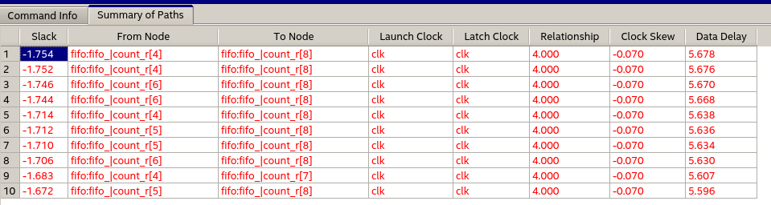
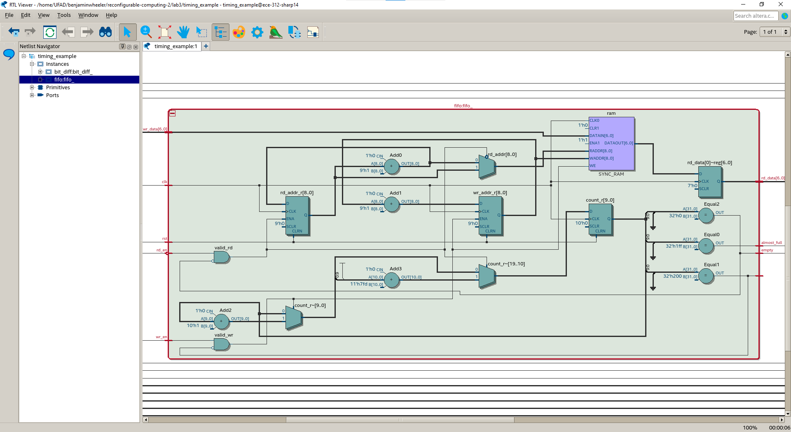
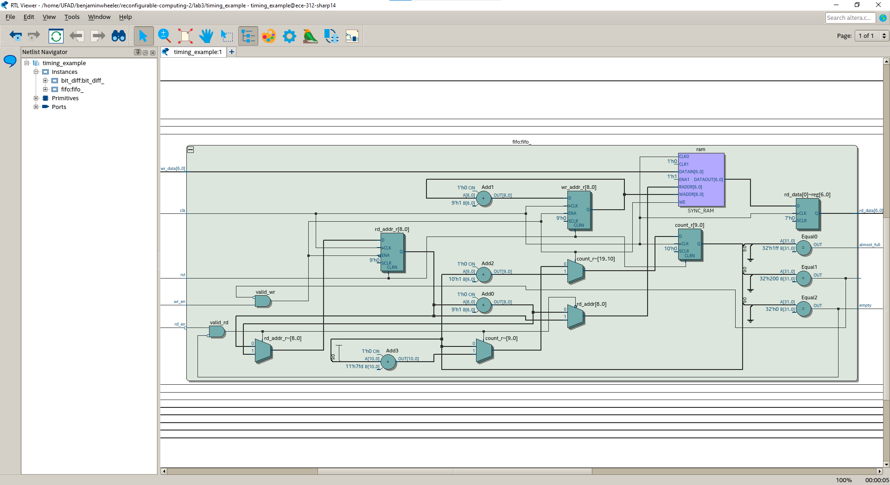
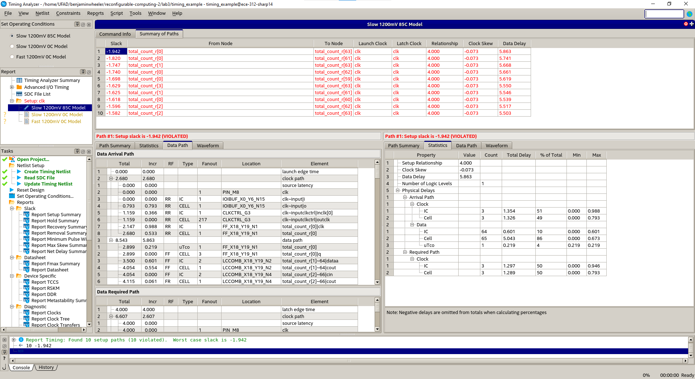

# Report

# Crit Path 1
I ran the timing analyzer > Report path... > report 1 path for Slow 1200mV 85C Model

**Initial Fmax = 104MHz**

First several critical paths were from the fifo_rd_data port to the multiplier inputs.

I right-clicked on "From Node" > Locate Path > Locate in Technology Map Viewer

Here's one of the paths:

## Fix
Added fifo_rd_data_r

**New Fmax = 173.79 MHz**

# Crit Path 2

New critical path is in the FIFO count signal:

Old FIFO:

New FIFO:

I'm honestly not sure _why_ this worked. It probably is more apparent in the Technology Map viewer.

**New Fmax = 168.29 MHz**

# Crit Path 3

Critical path:

`total_count_r` does not get updated every cycle, so the fix is to specify that it is a multicycle path.

Added multicycle paths in `timing_example.sdc`.

**New Fmax = 202.88 MHz**

# Crit Path 4

(Forgot to take screenshot) FIFO output was taking long. I added an additional delay register right after the FIFO RAM output. Now there are two registers there.

I also had to update the rest of the circuit to accomodate this, mostly by increasing the PIPE_LATENCY and matching the pipeline input delay of the pipe inputs to that of the FIFO (2 clock delay, up 1).

**New Fmax = 203.13 MHz**
